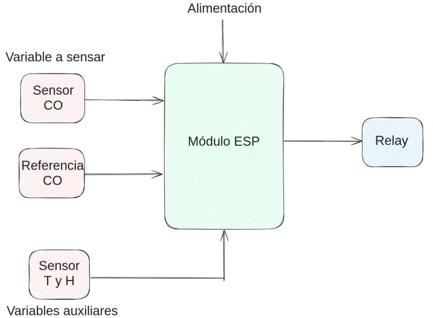

# Smart_sensors
En este repositorio se aloja toda la información pertinente al desarrollo de un conjunto de sensores que interactuan con IoT  + IA

## __Introducción:__

Este proyecto se enfoca en el monitoreo ambiental mediante sensores de temperatura, humedad y monóxido de carbono. Mediante el muestreo de estras tres variables, se puede conocer cómo cambia el clima dentro de una habitación. Para esto, el sistema se puede comportar de acuerdo al siguiente diagrama en bloques:

  

El diagrama anterior muestra cómo los sensores de tempertura y humedad, denotados como "Sensor T y H", y el sensor de monóxido de carbono, denotado como "Sensor CO", envian datos al Módulo ESP, el cual recolecta estos datos. Estos datos pueden ser enviados a la nube para poder ser almacenados. Luego, de ser necesario, se puede actuar sobre un módulo Relay, para activar algún sistema de potencia, como por ejemplo, un ventilador.

El Módulo ESP posee conexión mediante WiFi, lo cual posibilita utilizar protocolos MQTT y HTTP, entre otros. Actualmente el Módulo utiliza MQTT para transmitir los datos de temperatura y humedad, por lo tanto si se quiere obtener los datos de dichos sensores, se puede acceder a su información mediante los siguientes tópicos:

### __Tópicos__:

Temperatura: Temperature

Humedad: Humidity

Monóxido de Carbono: CO

Relay: Relay_in

De esta forma, para tomar los datos, basta con acceder a uno de estos tópicos. 

